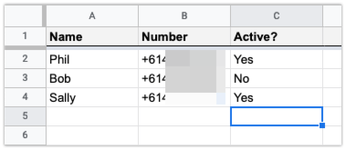

# Phone number availability with Google Sheets

This is a Function that you can use with a Studio Flow to return numbers that you can use in the Connect Call To widget in Simulring mode. It reads numbers from a Google Sheet and filters out inactive numbers.

* [How to use this](#how-to-use-this)
  * [Spreadsheet setup](#spreadsheet-setup)
  * [Google credentials setup](#google-credentials-setup)
  * [Twilio Setup](#twilio-setup)
    * [Twilio Serverless Toolkit](#twilio-serverless-toolkit)
    * [Twilio Functions UI](#twilio-functions-ui)
    * [Twilio Studio Flow](#twilio-studio-flow)
    * [Twilio Phone Number](#twilio-phone-number)
* [You're ready](#youre-ready)
* [LICENSE](#license)

## How to use this

### Spreadsheet setup

- [Create a new Google Spreadsheet](http://sheets.google.com/)
- Give it the column headings "Name", "Number", and "Active?" in that order
- Enter the people and phone numbers for the people that could be involved in the simulring
- Mark active numbers with the word "Yes". Any other input will mark the number as inactive

### Google credentials setup

- In the [Google developer console](https://console.developers.google.com/), create a new project.
- Click _Enable API_. Search for and enable the **Google Drive API**
- _Create Credentials_ for a _Web Server_ to access _Application Data_
- Name the service account and grant it a _Project Role_ of _Editor_
- Download the JSON file of credentials and open it up
- Find the "client_email" key in the JSON file and get the email address. Back in your spreadsheet click the _Share_ button and paste the client_email into the share field to give that email address access to the spreadsheet. We'll need these credentials again, so keep them safe

### Twilio Setup

- In your Twilio console [buy a new phone number with Voice capabilities](https://www.twilio.com/console/phone-numbers/search)

You can deploy the Twilio Function for this application two ways, using the [Twilio Serverless Toolkit](#twilio-serverless-toolkit) or the [Twilio Functions UI](#twilio-functions-ui).

#### Twilio Serverless Toolkit

You will need [Node.js installed](https://nodejs.org/en/download/) to perform this method.

- Clone this repo

      git clone https://github.com/philnash/simulring-control.git

- Change into the directory and install the dependencies

      cd simulring-control
      npm install

- Copy the `.env.example` file to `.env`

      cp .env.example .env

- Fill in the `.env` file with your Twilio Account Sid and Auth Token (available in your [Twilio Console](https://www.twilio.com/console/))
- Open your Google Spreadsheet and look at the URL bar, it should look like `https://docs.google.com/spreadsheets/d/{GOOGLE_SPREADSHEET_KEY}/edit#gid=0`. Take the string that represents your `GOOGLE_SPREADSHEET_KEY` and enter that into `.env`
- Take the Google credentials JSON file you downloaded earlier and move it into the assets directory. Call it `assets/auth.private.json`.

Now you should be ready to deploy.

- Deploy the project to Twilio Functions

      npm run deploy

#### Twilio Functions UI

- Open the [Twilio Functions admin console](https://console.twilio.com/us1/develop/functions/services?frameUrl=%2Fconsole%2Ffunctions%2Foverview%2Fservices%3Fx-target-region%3Dus1)
- Create a new Service
- Within the Service create a new Function
- Give the Function a path, like `/active-numbers`
- Make sure the Function is set to be "protected"
- Replace the code with the contents of `functions/active-number.protected.js` from this repo
- Save the Function
- Take the Google credentials JSON file you downloaded earlier and upload it as a private asset called `auth.json`.
- Open the Environment Variables settings
- Open your Google Spreadsheet and look at the URL bar, it should look like `https://docs.google.com/spreadsheets/d/{GOOGLE_SPREADSHEET_KEY}/edit#gid=0`. Take the string that represents your `GOOGLE_SPREADSHEET_KEY` and enter that as an environment variable called `GOOGLE_SPREADSHEET_KEY`
- Create another environment variable called `GOOGLE_CREDENTIALS` and set it to `/auth.json`
- In dependencies, enter `google-spreadsheet` with the version `3.3.0`
- Deploy the Function Service

#### Twilio Studio Flow

Once you have deployed the Function in either of the ways described above, you need to create the Studio Flow that is going to use it.

- In the Twilio console go to [Studio Flows](https://console.twilio.com/us1/develop/studio/flows?frameUrl=%2Fconsole%2Fstudio%2Fflows%3Fx-target-region%3Dus1)
- Create a new blank Flow
- Drag a *Run Function* widget onto the canvas
- In the widget settings choose the Function Service you just created, then the environment ("dev" if you deployed with the Serverless Toolkit, "ui" if you deployed from the console), then the function `/active-numbers`
- Drag a *Connect Call To* widget onto the canvas
- Connect the *Incoming call* trigger to the *Run Function* widget and the success transition of that widget to the *Connect Call To* widget
- In the *Connect Call To* widget settings choose *Multiple Numbers (Simulring)* and in the *Phone numbers or clients* input enter `{{widgets.function_1.body}}` (this uses the result of the function to populate the numbers you are going to call)
- Save all the widgets and publish the Studio Flow

#### Twilio Phone Number

- Go back to the phone number you bought earlier
- In the voice section change when *A call comes in* to *Studio Flow* then choose the Flow you just created
- Save the number

## You're ready

- Ensure that at least one of the numbers in your spreadsheet has "Yes" in the "Active?" column
- Dial your Twilio number and the Studio Flow will use the Function to fetch the active numbers from the sheet and make simultaneous calls to them until one picks up

## LICENSE

MIT © Twilio Inc.
